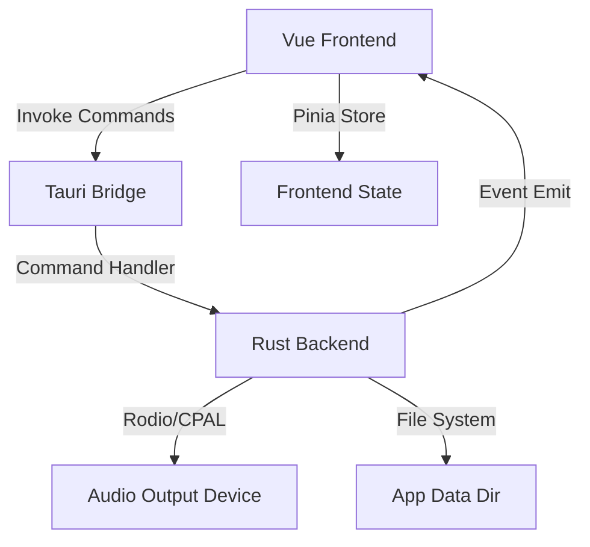

# Project Overview
Claket-Tauri is a modern, native soundboard application built with Tauri v2, Vue 3, and Rust. It enables high-performance, low-latency audio playback with precise control over output devices—making it ideal for streamers and power users (e.g., integrating with VoiceMeeter). The application prioritizes reliability by copying imported audio files to a dedicated local app directory and uses a unified state management system across the Rust backend and Vue frontend.

## Repository Structure
* `src/` – Frontend source code built with Vue 3 (Composition API) and TypeScript.
* `src/assets/` – Static assets like images and icons used in the frontend.
* `src/components/` – Reusable Vue components, including a custom TitleBar and UI elements.
* `src/components/ui/` – Base UI components built with shadcn-vue and Tailwind CSS v4.
* `src/lib/` – Shared frontend utility functions and helpers.
* `src/stores/` – Pinia state management for audio configuration and application state.
* `src-tauri/` – Backend source code and configuration for the Tauri/Rust layer.
* `src-tauri/src/` – Core Rust logic, including audio processing (`audio.rs`) and Tauri integration (`lib.rs`).
* `src-tauri/capabilities/` – JSON definitions for Tauri v2 security permissions and feature access.
* `src-tauri/icons/` – Application icons for various platforms (Windows, macOS).
* `public/` – Public static assets served by Vite.

## Build & Development Commands
```bash
# Install all dependencies (Frontend)
bun install

# Start the development environment (Vite + Tauri window)
bun run dev

# Build the application for production
bun run build

# Run Tauri development command directly
bun run tauri dev

# Preview the built frontend locally
bun run preview
```

## Code Style & Conventions
* **Frontend**: Follow Vue 3 Composition API patterns using `<script setup>`. Use TypeScript for all logic.
* **Styling**: Use Tailwind CSS v4 utility classes and shadcn-vue components.
* **Backend**: Follow standard Rust conventions (snake_case for variables/functions).
* **Communication**: Use Tauri commands (`#[tauri::command]`) for JS-to-Rust calls and events (`Emitter`) for Rust-to-JS notifications.
* **Audio**: Always process audio logic in Rust via `rodio` and `cpal` to ensure native device access.
* **Persistence**: Use `tauri-plugin-store` for settings and local filesystem for audio file storage.

## Architecture Notes

The application follows a decoupled architecture where the frontend manages the UI state and grid layout, while the Rust backend handles the heavy lifting of audio decoding, device management, and file persistence. Real-time feedback (like playback progress) is pushed from Rust to Vue via an event bus.

## Testing Strategy
> TODO: Unit and integration testing frameworks (Vitest/Rust tests) are currently unconfigured. Local manual verification is required via `bun run dev`.

## Security & Compliance
* **Permissions**: Access is managed via Tauri v2 capabilities located in `src-tauri/capabilities/`.
* **File System**: The app only interacts with the user-selected audio files and its own `app_data_dir`.
* **CSP**: Content Security Policy is currently relaxed for development but should be tightened for production.

## Agent Guardrails
* **Protected Files**: Do not modify `src-tauri/icons/` unless specifically requested.
* **Audio Logic**: Changes to audio processing MUST happen in `src-tauri/src/audio.rs`, never in the frontend.
* **Dependencies**: Use `bun` for package management; do not use `npm` or `yarn`.
* **Refactoring**: Ensure `lsp_diagnostics` are clean for both TypeScript and Rust before finishing tasks.

## Extensibility Hooks
* **Plugin System**: Uses standard Tauri v2 plugins (`dialog`, `opener`, `store`).
* **Environment**: Configuration is stored in `tauri.conf.json` and persistent store JSON files.
* **Grid**: The UI is designed to be dynamically extensible via the `audio` Pinia store.

## Further Reading
* [Tauri v2 Documentation](https://v2.tauri.app/)
* [Vue 3 Composition API](https://vuejs.org/guide/introduction.html)
* [Rodio Audio Library](https://github.com/RustAudio/rodio)
* [Tailwind CSS v4](https://tailwindcss.com/blog/tailwindcss-v4-alpha)
